<table style="width:100%">
  <tr>
    <th width="100%" colspan=6><h2>XUP SDx Labs (2018.3)</h2></th>
  </tr>
  <tr>
    <td align="center"><a href="setup_sdx.md">1. Setup SDx</a></td>
    <td align="center"><a href="sdx_introduction.md">2. Introduction to SDx</a></td>
    <td align="center"><a href="Optimization_lab.md">4. Optimization</a></td>
    <td align="center"><a href="rtl_kernel_wizard_lab.md">5. RTL Kernel Wizard</a></td>
    <td align="center"><a href="debug_lab.md">6. Debugging</a></td>
    <td align="center"><a href="sources/helloworld_ocl/command_line.ipynb">7. SDx command line</a></td>
  </tr>
</table>

# SDx

## Introduction

This lab guides you through the steps involved in creating an SDx project. After creating the project you will run software and hardware emulation to verify the functionality of the design. You can also test the design in hardware.

### Description of example application

The source code for the example design will be provided. The design consists of a C++ host application and an OpenCL kernel. The OpenCL kernel is a simple vector addition. The elements of 2 vectors (A & B) will be added together, and the result returned in a third array (C). The host application will initialize the two input arrays, send data to the kernel, and read back the result. The first elements of the arrays will be initialised with 0, or a value passed to the function. The initial value for each subsequent element will be incremented. E.g. If the initialization value is 0, A & B will have the initial values [0,1,2,3 ...]. This will result in the following values returned to C [0,2,4,6 ...]

You will compile and check a software only version of the application. The *vector add* OpenCL kernel will then be implemented as a hardware kernel. You will first build an emulation version of the design and run a simualation of the hardware kernel. You will then test the application with the kernel running in the FPGA.

## Objectives

After completing this lab, you will be able to:

- Create an project using the SDx GUI
- Run Software Emulation to verify the functionality of a design
- Run Hardware Emulation to verify the functionality of the generated hardware
- Build the system and test it in hardware 
- Perform profile and application timeline analysis on the design running in hardware


## Steps
### Create an SDx Project

* Launch SDx by executing **sdx** in a terminal window, or click on the **SDX** desktop icon if available
You will be prompted to select a workspace directory

* Click Launch to accept the default (usually ~/workspace)
The Xilinx SDx IDE window will be displayed.

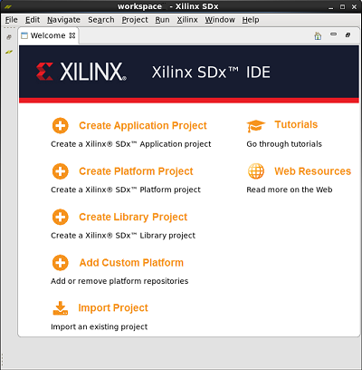

* Click on **Create Application Project**
The _Project Type_ page will be displayed 

* Enter **hello_world** as the _Project name_ and click **Next**  

* Select the target platform and click **Next**

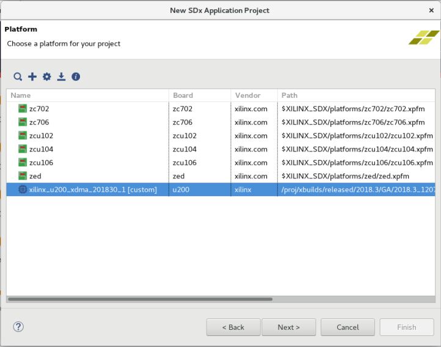

* Select **Empty Application** and click **Finish**

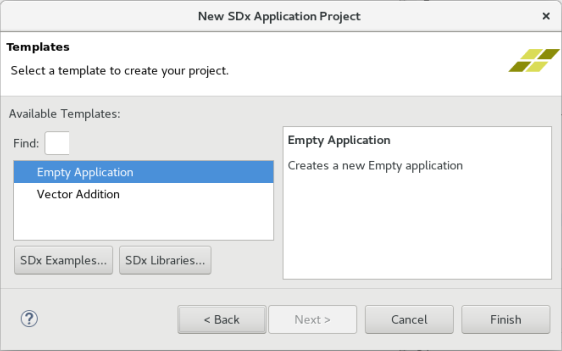

The SDx *development* view should open:

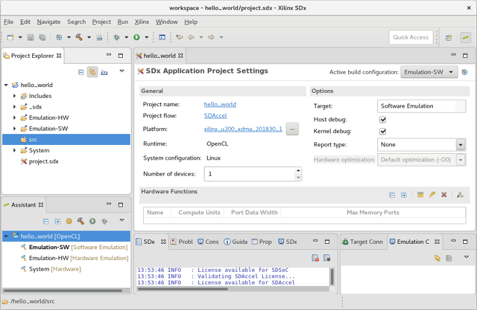

There are different *view* settings in SDx, and all perspectives are customizable. Panels can be added or removed, and the layout can be changed. For example, the *Debug* perspective has a different default layout and views. 

There are six main windows in this perspective: Project Explorer, Main panel (SDx Application Project Settings in the image above) , Assistant, Outline, multi-tab console, and Emulation Console.

* In the Project explorer, expand the *hello_world* folder if necessary, and *right click* on the **src** folder, and select **import**

* In the *Import* window, select **General>File System** and click **Next**

    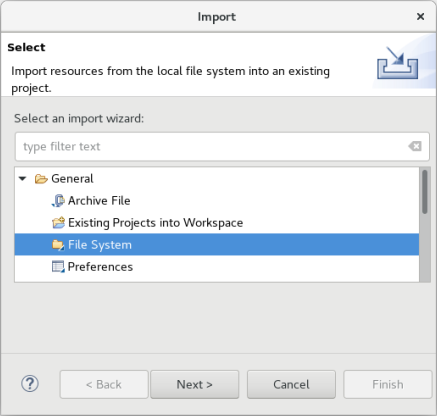

* Browse to the ~/sdxlabs/sources/helloworld_ocl/src directory, and click **OK** to select this directory

    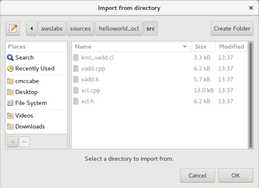

* Select all five source files **krnl_vadd.cl**, **vadd.cpp**, **vadd.h**, **xcl.cpp**, **xcl.h** and click **Finish**

    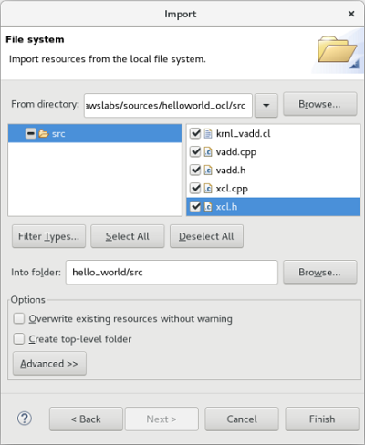

* **krnl_vadd.cl** is the OpenCL source for a simple vector addition kernel
* **vadd.cpp/.h** are the host application source and header
* **xcl.cpp/.h** are the header and source for some helpful OpenCL function wrappers

### Perform Software Emulation

* Make sure the *SDx Application Project Settings* are visible in the main panel. If they are not, open **project.sdx** under _hello\_world_ in the **Project Explorer** tab.

* In the project settings, in the **Hardware Functions** section, click on the _Add Hardware Function_ button icon (). 

    SDx will automatically parse the source files, and will list functions defined in the design here. 

    This design has only one function `krnl_vadd()` that is a candidate for hardware acceleration.

    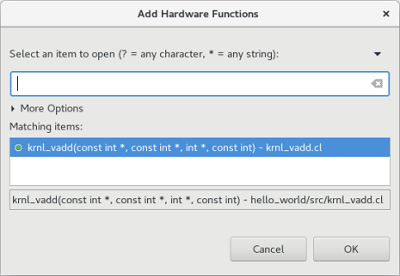

* Select the `krnl_vadd()` function and click **OK** 

This will automatically add a *binary container* and include the function inside it. 

* Click on the drop-down button of _Active build configuration_ and make sure **Emulation-SW** is selected. Alternatively, this can also be set from the **Project** menu **Build Configurations &gt; Set Active &gt; Emulation-SW** 

    

* Click on the build () button or alternatively, select **Project &gt; Build Project**

This will build the project and generate hello_world.exe under the *Emulation-SW* directory

* From the SDx menu, select **Run &gt; Run Configurations…** to open the configurations window

From here, arguments can be passed to the host application. The binary container needs to be passed to the host. 

As mentioned in the introduction, the two arrays that will be added together can be initialized by passing a value to the host application. This initialization value can also be set here. 

* Click on the **Arguments** tab and select **Automatically add binary container(s)  arguments** 

**../binary_container_1.xclbin** should be automatically added to the text area. Add the initilization value for the arrays by typing a number into the box. In this case, type **0** after *../binary_container_1.xclbin* (with a space inbetween the two arguments).


* Click **Run** to save the configuration and run the application

The application can also be run by clicking the Run button (). 

The application will be run and the output will be displayed in the Console tab

You should see a **TEST PASSED** message, preceded by the values of the elements of the arrays, and the result of the addition. 

```
   TEST PASSED
```

You can go back and change the initialization value passed to the host in the *Run Configuration*, and rerun the application to see different numerical results. 


### Perform Hardware Emulation

The *Software Emulation* flow checks functional correctness of the software application, but it does not guarantee the correctness of the design on the FPGA target. The *Hardware (HW) Emulation* flow can be used to verify the functionality of the generated logic. This flow invokes the hardware simulator in the SDx environment. As a consequence, the HW Emulation flow will take a little longer to build and run than the SW Emulation flow.

The Hardware Emulation flow is not cycle accurate, but provides more detailed profiling information than software emulation. It can be used to do some analysis and optimization of the performance of the application.

* Click on the drop-down button of _Active build configuration_ and select **Emulation-HW** 


* Click on the () button. 

This will build the project including hello\_world.exe file under the Emulation-HW directory

* Select **Run &gt; Run Configurations…** to open the configurations window
* Click on the **Arguments** tab and check if _binary\_container\_1.xclbin_ is already assigned. Optionally set an initialization value as before.

* Click **Run** to run the application
* The Console tab shows that the test was completed successfully along with the data transfer rate

```console
   TEST PASSED
   INFO: [SDx-EM 22] [Wall clock time: 11:36, Emulation time: 0.0418116 ms]
   Data transfer between kernel(s) and global memory(s)
   krnl_vadd_1:m_axi_gmem-DDR          RD = 32.000 KB              WR = 16.000 KB   
```

### Review the HLS Report

* In the **Assistant** tab, under **Emulation-HW &gt; binary\_container\_1 &gt;  krnl\_vadd** double-click on the **HLS Report**

    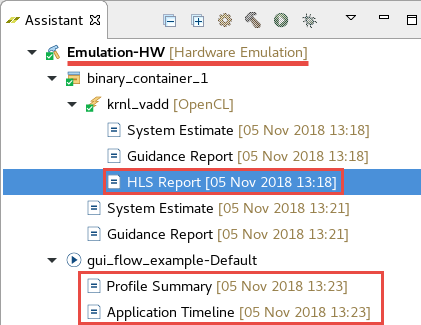

The window will open showing the Synthesis report for the **krnl_vadd** accelerator.

* Scroll down the window and observe the timing, latency, and loop performance results. 

Observe the target clock period. This will be 3.33 (ns) or 4.00 (ns) depending on the target (AWS/Alveo) you are using. You will see how to set the clock later. Check the estimated actual clock period, which should be less than the target, indicating that the timing has been met. 

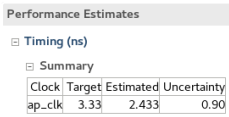

* Scroll down further and observe the resource utilization by the accelerator (again the numbers may be different to your results)

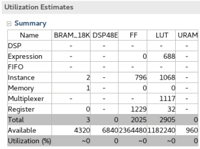

###  Review the profile summary report

* In the **Assistant** tab under **Emulation-HW &gt; hello\_world-Default** double-click on the **Profile Summary** entry 

The numbers in this report will vary depending on the value of the DATA_SIZE constant in vadd.cpp. When you have completed this section, you can go back and change DATA_SIZE, recompile and rerun the application, and check the updated profiling results. 

Notice the report window has four tabs: **Top Operations, Kernels and Compute Units,  Data Transfers, OpenCL APIs**. 

The *Top Operations* tab summarizes the profiling information for the design. There is only one kernel in this design. Arrays A and B are transfered to memory, then to the kernel, and the result C is written back from the kernel to memory. 

The PCIe interface between the host and FPGA is 512 bits, or 64 bytes. This will determine the average bytes per transfer, and the transfer efficiency. 

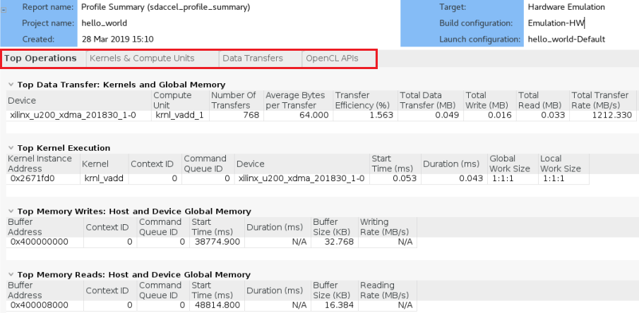

* Click on the **Kernels &amp; Compute Units** tab and observe the number of Enqueues (1), and the kernel execution time .

* Click on the **Data Transfers** tab.

    ​    

* Look at the transfers between *HOST and Global Memory*

In the host application, A and B are written from *HOST* memory to *GLOBAL* memory and C is read back to *HOST* memory from *GLOBAL* memory. This is why the *WRITE* data is ~2x the amount of the *READ* data. There is only one transfer as the arrays are transferred as one block of data. 

* Look at the transfers between *Kernels and Global Memory*. In this example there is only one kernel.

The kernel *READS* A and B, and *WRITES* C. This is why there are 2x the number of read transfers compared to write transfers. There are multiple transfers as each element of the array is read into the design sequentially. 

Observe the average size of the data transferred, and the estimated transfer rates. These profile summary will be useful when trying to optimize your own designs. 

### Review the System Estimate report

* Double-click on the **System Estimate** entry under the **Emulation-HW > binary_container_1 > krnl_vadd** in the **Assistant** tab
  The report shows the estimated frequency and the resource utilization for the given kernel (krnl\_vadd)


### System Build

At this stage, you could build the project, but as it take some time to compile you can skip this step for now. See the Appendix below for instructions on how to build the hardware. 

## Run the precompiled solution (Optional)

As building the FPGA hardware takes some time, a precompiled solution is provided. The results should not be any different to the HW and SW emulation, so this step is optional. 

* From the SDx file menu, select **import**
* Expand *Xilinx* and select **SDx Project** and click **Next**
* Choose *SDx project exported zip file* and click **Next**
* Browse to **~/sdxlabs/solutions/hello_world/u200/hello_world_sol.zip** and click **OK**

You should see a new *hello_world_sol_* folder in the Project Explorer

#### Set the executable file permissions

Zip files do not preserve Unix file permissions, so the executable permissions must be modified manually.

* Expand *hello_world_sol > System* and right click on **hello_world_sol.exe**

* Select **Execute** for the *Owner* permissions and click **Apply and Close**

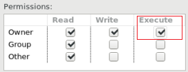

* 

#### Disable Auto building

* Right click on the project folder, select C/C++ Build Settings
* In C/C++ Build, in the **Behavior** tab make sure the following are unchecked: *Build on resource save (Auto Build)*, *Build (incremental build)* and *Clean* 
* Click **Apply and Close**

#### Run the application

* Open the project.sdx and select **System** as the *Active build configuration*
* In the SDx *Run* menu, select **Run Configurations**
* Expand OpenCL if necessary, and select the **hello_world_sol-Default** configuration
* Check the *binary container* has been included in the *Arguments* tab and click **Run**

You should see the application output in the console. The output should be similar to what you saw for the SW and HW Emulation runs. 

## Conclusion 

In this lab, you used SDx to create a project. You ran the design using the software and hardware emulation flows, verified the output, and reviewed the reports. 

---------------------------------------

Continue to the [optimization Lab](./Optimization_lab.md)

---------------------------------------

## Appendix: Build Full Hardware

Note that building the project can take around two hours. Skip this step in a tutorial environment.

* Click on the drop-down button of _Active build configuration_ and select **System** or select **Project &gt; Build Configurations &gt; Set Active &gt; System**

* Click on the () button or select **Project &gt; Build Project**
This will build the project under the **System** directory. The built project will include **hello\_world.exe** file along with **binary\_container\_1.xclbin** file. 

### Test on Alveo

* Once the project is built, you can click on the *run* button () and verify you see the same results as before. For AWS, see the next step.

### Test on AWS (create AFI)

Before the design can be run on AWS an AFI (Amazon FPGA Image) is required.

Once the full system is built, you can create an AFI by following the steps listed <a href="Creating_AFI.md">here</a>

