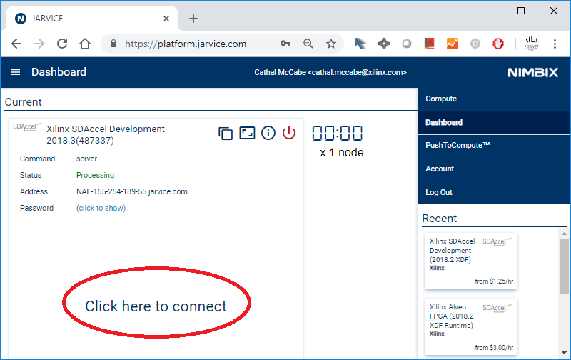
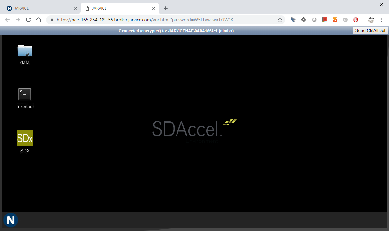

<table style="width:100%">
  <tr>
    <th width="100%" colspan=6><h2>XUP SDx Labs (2018.3)</h2></th>
  </tr>
  <tr>
    <td align="center"><a href="setup_sdx.md">1. Setup SDx</a></td>
    <td align="center"><a href="sdx_introduction.md">2. Introduction to SDx</a></td>
    <td align="center"><a href="Optimization_lab.md">4. Optimization</a></td>
    <td align="center"><a href="rtl_kernel_wizard_lab.md">5. RTL Kernel Wizard</a></td>
    <td align="center"><a href="debug_lab.md">6. Debugging</a></td>
    <td align="center"><a href="sources/helloworld_ocl/command_line.ipynb">7. SDx command line</a></td>
  </tr>
</table>

# Connecting to Nimbix

* Log in to Nimbix: https://platform.jarvice.com/

* Click *Compute* in the top left menu to select a compute instance

* Type Xilinx to filter the list of instances

* Select the *Xilinx SDAccel Development* instance

* Click on Desktop mode

* Select the instance you prefer. 

The smallest instance can be used for the labs. For the first part of the labs, you don't need to select an instance with Alveo hardware. 

When the instance is ready, you will see the option to *Click here to connect*.

* Click on the link to connect

A Linux desktop will open in a new tab in your browser.

