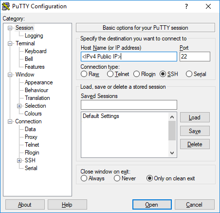
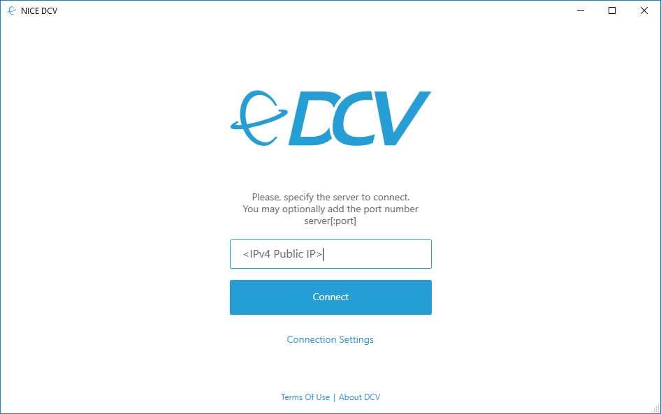
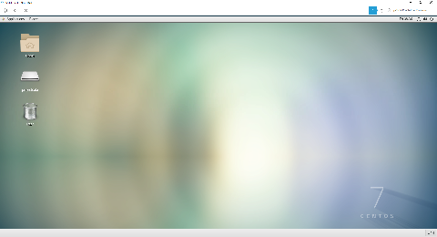

<table style="width:100%">
  <tr>
    <th width="100%" colspan=6><h2>XUP SDx Labs (2018.3)</h2></th>
  </tr>
  <tr>
    <td align="center"><a href="setup_sdx.md">1. Setup SDx</a></td>
    <td align="center"><a href="sdx_introduction.md">2. Introduction to SDx</a></td>
    <td align="center"><a href="Optimization_lab.md">3. Optimization</a></td>
    <td align="center"><a href="rtl_kernel_wizard_lab.md">4. RTL Kernel Wizard</a></td>
    <td align="center"><a href="debug_lab.md">5. Debugging</a></td>
    <td align="center"><a href="sources/helloworld_ocl/command_line.ipynb">6. SDx command line</a></td>
  </tr>
</table>

# Connecting to AWS

## Introduction

The following instructions are for attendees on a live instructor led workshop where an AWS F1 instance has been set up for you, and you have been provided with log-in details. If you are not attending a live workshop, go back to the [Setup SDx](./get_started) page and follow one of the other options to work through these labs.

This lab will guide you through the steps involved in connecting to an Xilinx workshop AWS EC2 F1 instance, and starting and stopping the instance.

## Objectives

After completing this lab, you will be able to:

- Connect to an AWS EC2 F1 instance using the provided credentials
- Start an instance
- Start a RDP (Remote Desktop Protocol) session
- Close the RDP session
- Stop the instance

## Steps
Each registered participant to Xilinx workshop has been allocated a pre-configured EC2 F1 instance and should have received an email with the following details:  

- Account ID, 
- IAM username, 
- Link to access a pre-configured EC2 F1 instance

### Login into the AWS and starting an F1 instance

* Follow the link provided by your instructor, or go to [https://console.aws.amazon.com/ec2](https://console.aws.amazon.com/ec2) to open a login page  
  If you had used the link then you should see a login page similar to shown here:

<p align="center">

</p>
<p align = "center">
<i>Login page accessed through the provided link</i>
</p>  

* Use the log in details provided by your instructor. 

* In the top right corner, using the drop-down button, select a region with F1 instances, such as **N. Virginia (US East)** or the region indicated by your instructor

<p align="center">

</p>
<p align = "center">
<i>Selecting a region</i>
</p>  
If you select the wrong region you may not see your instance.

* Click on the **EC2** link on the dashboard or if not visible, then click on the _Services_ drop-down button and then click on **EC2**

<p align="center">


</p>
<p align = "center">
<i>Accessing EC2 service</i>
</p>  

* Click on the **Instances** link on the left panel
    <p align="center">
    
    </p>
    <p align = "center">
    <i>Accessing Instances</i>
    </p>  
    You may see several instances
* Enter your username in the filter field just below the **Launch Instance** button and hit enter
    <p align="center">
    
    </p>
    <p align = "center">
    <i>Filtering your instance</i>
    </p>  
* Making sure that your instance is selected, click on the **Actions &gt; Instance State &gt; Start**
    <p align="center">
    
    </p>
    <p align = "center">
    <i>Starting an instance</i>
    </p>  
* Click on the **Yes, Start** button
* Click on the refresh button() to see the updated status to _Running_
    <p align="center">
    
    </p>
    <p align = "center">
    <i>Running state</i>
    </p>  
* Make a note of the Public DNS and IPv4 Public IP which will be used by PuTTy and Remote Desktop (RDP)
    <p align="center">
    
    </p>
    <p align = "center">
    <i>Assigned IP to the running instance</i>
    </p>  
### Interacting with the Instance using DVC

There is a bug in CentOS 7 elated to RDP. DVC as recommended by Amazon will be used to remote desktop to the instance. 

* Download and install the appropriate NICE DCV client here: https://download.nice-dcv.com

Open PuTTY, enter the IPv4 Public IP address from the Amazon console, and click open



This should open a terminal to the AWS instance. 

* In the terminal,enter the following command to start the DCV server:

```
dcv create-session --type virtual --user centos centos
```


* Stop the firewall

```
sudo systemctl disable firewalld
sudo systemctl stop firewalld
```


## NICE DCV

Open the NICE DCV application, enter the I*Pv4 Public IP* from the Amazon console and click **Open**




* When prompted, enter the username and password provided by your instructor to connect to the instance.




# Verify XRT and SDx tools

- Right-click on the desktop and select **Open Terminal** and verify the Xilinx SDx tools have been preinstalled and are on the path by executing the following command:

```
   which sdx
```

The XRT (Xilinx Run Time) tools are installed (/opt/xilinx/xrt) but are not included on the path by default. 

* Execute the following to change the permissions of the XRT setup file, and to automatically source the XRT tools. Make sure to only execute this once. 


```
   sudo chmod 774 /opt/xilinx/xrt/setup.sh
   echo "source /opt/xilinx/xrt/setup.sh" >> ~/.bashrc
```

For your reference, in the commands below, $AWS_FPGA_REPO_DIR has already been defined in the environment from: /etc/profile.d/aws-f1.sh 

* Exectue the following to clone the *aws-fpga* repository and setup the Xilinx tools. aws-fpga includes the AWS F1 tools, HDK and documentation:

```
   cd ~/src/project_data
   git clone https://github.com/aws/aws-fpga
   cd $AWS_FPGA_REPO_DIR                                         
   source sdaccel_setup.sh
   echo "export PLATFORM_REPO_PATHS=/home/centos/src/project_data/aws-fpga/SDAccel/aws_platform/xilinx_aws-vu9p-f1-04261818_dynamic_5_0" >> ~/.bashrc
    
```

For more details see:

https://github.com/aws/aws-fpga/blob/master/SDAccel/README.md

---------------------------------------

Return to [Setup SDx](./setup_sdx.md) and go to the **Getting started with the tutorials** section to finish setting up by cloning the tutorial labs. 

---------------------------------------

## Appendix: Interacting with the Instance using Putty

* Start **PuTTY** or your preferred SSH client

* Enter _centos@&lt;public\_dns\_entry&gt;_ in the **Host Name** field and **22** in the _Port_ field  
Make sure that SSH is selected as the Connection type
    <p align="center">
    
    </p>
    <p align = "center">
    <i>Session settings in PuTTY</i>
    </p>  
  
* Expand **SSH** under the _Connection_ in the left panel and click **Auth**

* Click on the **Browse…** button, browse to where the private key has been stored  
  If you don&#39;t have the private key file (as in workshop) you can skip this step

* Click **Open**
    <p align="center">
    
    </p>
    <p align = "center">
    <i>Selecting private key file</i>
    </p>  
    
* Click **Yes** 
The PuTTY window will open. It will ask for the password (in case of the workshop). Enter the provided password
  
    <p align="center">
    
    </p>
    <p align = "center">
    <i>The PuTTY window showing the connection</i>
    </p>  
  
* Set a password for the RDP connection with the following command

    ```
    sudo passwd <your choice of password> 
    ```

    You will use the same password in the RDP connection.

* Enter **exit** to close the session


### Connect using RDP (deprecated for 2018.3)

**You can communicate with the instance using command line through PuTTY or Git Bash, and using GUI through remote desktop (RDP) connection.**

- Start a remote desktop session

- Enter the _IPv4_ address

- Click on the **Show Options**

  

- Select the **Display** tab and select _True Color (24 bit)_ and click **Connect**

  

- A certificate warning will be displayed. Click **Yes** to open the RDP session

- Enter centos as the username and enter the provided password and click **OK**

  